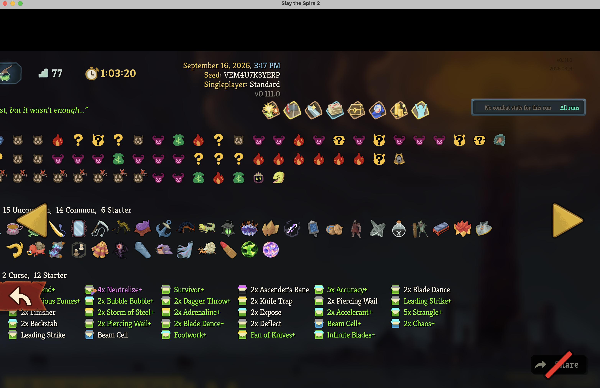

# Run History shifts left after viewing a long run

Confirmed in playtesting on September 28, 2026. Status: fix implemented;
native layout regression checks pass, with manual input checks still pending.
Affected screen: **Compendium → Run History**. The screenshot shows game
version **v0.111.0**.

## Observed behavior

Opening a long Gravity run shifts the run-history page to the left. Encounter
rows extend beyond the visible area, and the left side of the page is cut off,
including run details, act labels, relics, and deck entries.

The shift persists when navigating to other run-history entries, including
shorter runs. It is not confined to the long entry that triggered it. Persistence
after leaving and reopening the screen or restarting the game has not been
established.

Expected behavior: every run-history entry fits within the page or provides a
way to reach overflowing content, and viewing a long run does not displace
subsequent entries.

## Reproduction

1. Open **Compendium → Run History** with a saved long Gravity run available.
2. Navigate to that run. Observe the page shifting left and content being cut off.
3. Navigate to a shorter run using the history arrows. Observe that the page
   remains shifted left.

The captured example is the **77-visit run dated September 16, 2026, 3:17 PM**,
with seed **VEM4U7K3YERP** and duration **1:03:20**. Its local history file is
`1789597034.run`, with **31, 26, and 20 visits** in its three acts. This existing
history can be used to reproduce the bug without another playthrough.

## Screenshot

The screenshot captures the long entry's displaced layout. The persistence
across other entries was separately confirmed during playtesting.

## Cause and fix

The game's `NActHistoryEntry` places every encounter directly in an
`HBoxContainer`. Its minimum width grows with the visit count and propagates
through the centered containers to the whole page. The outer content container
grows horizontally in both directions; its expanded bounds can persist after
loading a shorter history.

`src/GravityRunHistory.cs` moves the existing encounter controls into an
`HFlowContainer` after the act initializes. Encounters wrap within the existing
history width, keeping their native size, player bindings, tooltips, and floor
numbers. Extra rows use the existing vertical page scroller. Act labels align
with the first row, and left/right focus links follow visit order across wraps.
The patch applies to the history display, including old runs, without changing
saved data or depending on whether a run is currently active.

## Verification

- Release builds and the full offline integration suite pass against the local
  stable and public-beta assemblies.
- A disposable beta game copy loaded the original 77-visit fixture and synthetic
  histories up to 100 encounters per act. The page remained 1920 units wide at
  its original horizontal position, including after switching back to a short
  history and then an empty history.
- The reusable native test is `tests/GravityRunHistoryTests`; setup is documented
  in [Development checks](development.md#native-run-history-layout-regression).
  The isolated copy lacks some other mods used in the original run, so those
  mods' missing art is not part of the layout verification.

Manual follow-up: hover encounters on every wrapped row, navigate across wraps
with a controller, scroll down to the deck, switch co-op player tabs, and repeat
long → short navigation at the player's usual window size.
